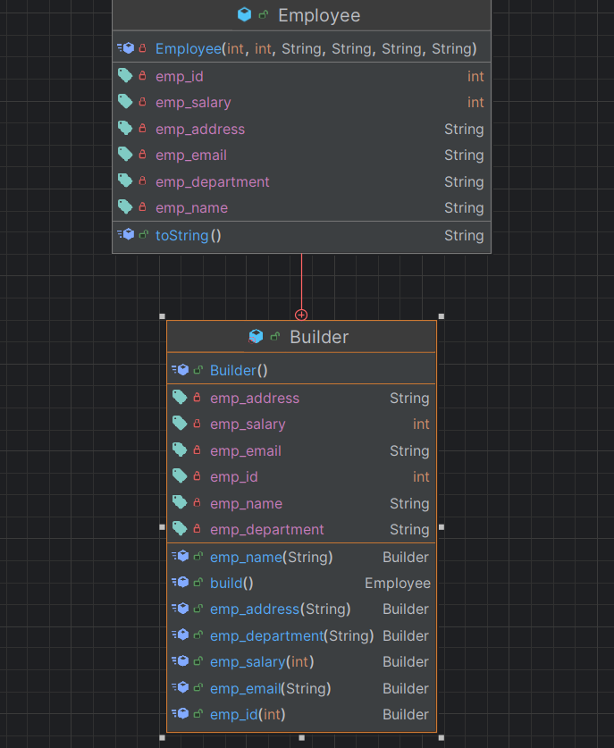
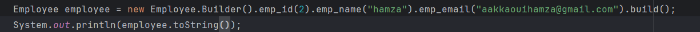

### Builder ###
- **Definition:**
  Le pattern Builder est un patron de conception de création qui permet de construire des objets complexes étape par étape. Contrairement aux constructeurs traditionnels, il sépare la construction d'un objet de sa représentation finale, ce qui permet de créer des représentations différentes en utilisant le même processus de construction.
- il existe plusieurs façons d'implémenter le pattern Builder en fonction des besoins spécifiques du projet.
- ### Builder avec une classe statique imbriquée (Inner Static Class) ###
     Cette approche est très populaire en Java, notamment parce qu'elle permet de construire des objets de manière fluide et concise, tout en respectant les principes d'encapsulation.
- ### Dans Spring Boot ###
- l'annotation @Builder ne connaît pas l'implémentation sous-jacente, c'est-à-dire qu'elle ne sait pas comment les objets sont construits en interne. C'est une abstraction qui permet de générer un builder pour une classe sans avoir à écrire manuellement le code de construction."
- ### Example ###

