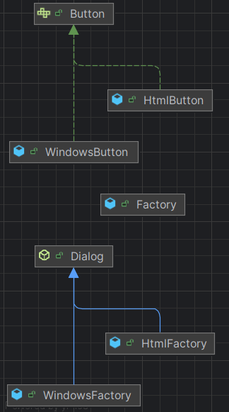

### Factory Method : ### 
- **Definition :** Fabrique est un patron de conception de création qui définit une interface pour créer des objets dans une classe mère, mais délègue le choix des types d’objets à créer aux sous-classes.
- **But :** Déléguer la création d'un objet spécifique à une sous-classe, ce qui permet à la classe mère de ne pas connaître la classe concrète de l'objet qu'elle utilise. Ce pattern est utile lorsque tu veux permettre à une sous-classe de décider quel type d'objet instancier en fonction de besoins spécifiques.
- **Utilisation :** Tu utilises le Factory Method lorsque tu as une hiérarchie de classes, et que tu veux permettre à chaque sous-classe de définir la méthode d'instantiation d'un produit particulier.
- **Exemple :** 
- 