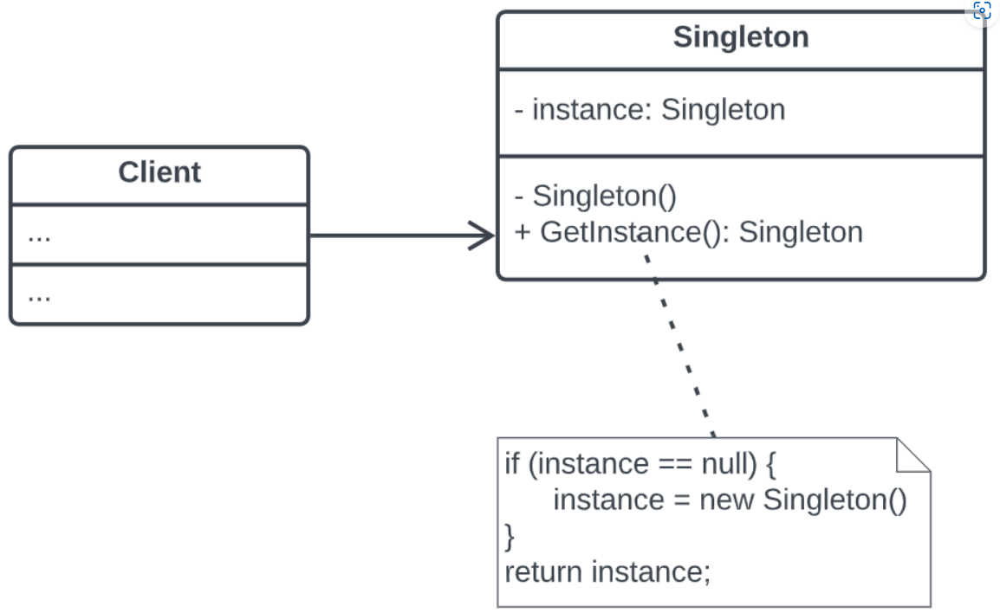

### Singleton: ### 
est un patron de conception de création qui garantit que l’instance d’une classe n’existe qu’en un seul exemplaire, tout en fournissant un point d’accès global à cette instance.

###  Problème ###

- **Il garantit l’unicité d’une instance pour une classe.** Son fonctionnement est le suivant : vous créez un objet, mais après un certain temps, vous décidez d’en créer un autre.
Plutôt que de vous retrouver avec un objet flambant neuf, vous récupérez celui qui existe déjà.

- **Il fournit un point d’accès global à cette instance.** Vous rappelez-vous ces variables globales que vous (bon, d’accord : moi) avez utilisées pour stocker des objets essentiels ? Elles sont très pratiques mais peu fiables,
puisque n’importe quelle partie du code peut potentiellement écraser leur contenu et faire planter l’application.

- ### Structure ###

- ### Example ###
Imagine that we have a bank application that registers all operations of each client in a single place.
- We can use the Singleton Design Pattern to ensure that there is a unique instance managing these operations.